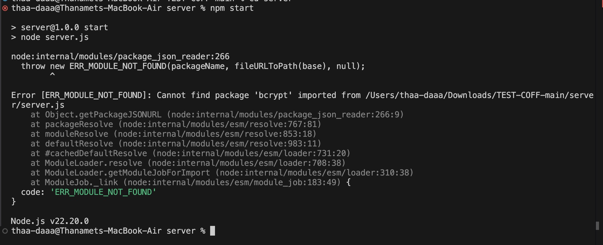

# DTN Coffee Shop Web Application Project
## Project Setup
### 1. Clone Project Repository ลงใน Directory ที่ต้องการ หรือ download zip ลงให้เครื่อง

### 2. ตั้งค่า MySQL
- Import file **sec2_gr8_database.sql** ลง MySQL Workbench แล้ว execute ทั้งหมด
- refresh schema 1 ครั้ง
- ตั้งค่า User Privillage
  - กดปุ่ม Add Account
  - Username =
  - MySQL_HOST =
  - Password =
  - ตั้งค่า Schema Privillage โดยให้สิทธ์ ... พร้อมเลือกฐานข้อมูล **sec2_gr8_database**

Note
-- ในกรณีที่ไม่สามารถสร้าง Users and Privileges
-- DROP USER IF EXISTS 'CoffeeShop'@'localhost';
-- CREATE USER 'CoffeeShop'@'localhost' IDENTIFIED BY 'Coffee1234';
-- GRANT ALL PRIVILEGES ON *.* TO 'CoffeeShop'@'localhost';
-- FLUSH PRIVILEGES;

`Note ถ้ากรณี execute แล้ว table record ล่างสุดมี null ต้อง FLUSH TABLE; ก่อน`

### 3. ทำการเปิด Folder Section2_Group8
### 3. ทำการเปิด Terminal 1 แล้ว cd ไปที่ sec2_gr8_fe_src และ Terminal 2 แล้ว cd ไปที่ sec2_gr8_ws_src
### 4. ทำการติดตั้ง module ทั้งหมดที่ระบุในไฟล์ package.json โดยพิม **npm install** ในทั้ง 2 Terminal 

### 5. สร้างไฟล์ .env.local ให้ในไฟล์ มีรายละเอียดดังนัี้
NEXT_PUBLIC_API_URL=http://localhost:5050  
NEXT_PUBLIC_GOOGLE_MAPS_API_KEY=AIzaSyD-EXAMPLE-KEY-1234567890

### 6. Run Terminal
- เปิด terminal ของ sec2_gr8_fe_src จากนั้น run คำสั่ง **npm run dev** เพื่อ start frontend. 
frontend จะรัน ที่ port 3000 http://localhost:3000/
- เปิด terminal ของ sec2_gr8_ws_src จากนั้น run คำสั่ง **npm start** เพื่อ start backend. 
backend จะรัน ที่ port 5050

`กรณี run ฝั่ง server มีปัญหา error จะเกี่ยวกับ version ของแต่ละเครื่อง 
ให้ npm uninstall bcrypt แล้วให้ npm install bcryptjs. 
หลังจากนั้นให้ไปที่ไฟล์ server.js จากเดิมคือ import bcrypt from "bcrypt";  เป็น import bcrypt from "bcryptjs"; หลังจากนั้นให้ npm start เพื่อ start server`

### 6.API and Webservice testing Guide# TEST-COFF
// method: POST
// URL: http://localhost:5050/product
// Body (raw JSON)
  {
   "Product_Name": "Kenya Blend",
   "Product_Source": "Kenya",
   "Roast_Level": "D",
   "Size": "500g",
   "Taste_Note": "Goodtaste",
   "Price_per_kg": 500,
   "Image_URL": "https://i.pinimg.com/736x/01/f9/72/01f9728512f92813ebbac859baf4fe12.jpg"
 }

// method: PUT
// http://localhost:5050/product/16
// Body:(raw JSON)
{
"Product_Name": "Kenya Blend",
 "Product_Source": "Kenya",
 "Roast_Level": "L",
 "Size": "1kg",
 "Taste_Note": "Sweet and smooth",
 "Price_per_kg": 2000,
"Image_URL": "https://i.pinimg.com/736x/01/f9/72/01f9728512f92813ebbac859baf4fe12.jpg"
}